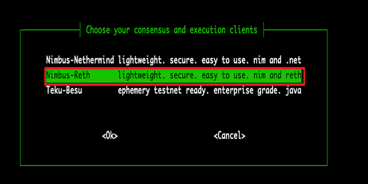

# Setup Validator for Endurance Staking

## Installation

run the following command:

```sh
/bin/bash -c "$(curl -fsSL https://raw.githubusercontent.com/OpenFusionist/EthPillar-Endurance/main/install.sh)"
```

## Running Nodes

To start running nodes, simply execute:

```sh
ethpillar
```

EthPillar’s TUI provides comprehensive step-by-step instructions. Additionally, we have recorded a video guide:

<div align="center">
  <iframe 
    width="800"
    height="450"
    src="https://www.youtube.com/embed/YLuZPUW9Q9Q" 
    title="EthPillar Setup Guide" 
    frameborder="0" 
    allow="accelerometer; autoplay; clipboard-write; encrypted-media; gyroscope; picture-in-picture" 
    allowfullscreen
  ></iframe>
</div>

Here are some screenshots of key steps:

- Selecting the Nimbus-Reth client (requires 4 CPU + 8G memory)

  

- Choosing the Endurance network

  

- Opting for solo-staking mode

  

## Generate Validator Key & Send Deposit

EthPillar integrates with [ethstaker-deposit-cli](https://github.com/OpenFusionist/ethstaker-deposit-cli) to assist users in managing Validators within the TUI. This includes generating and importing Validator keys, as well as making deposits.

To proceed, run `ethpillar`, select `Validator Client -> Generate / Import Validator Keys`, and follow the instructions. EthPillar will automatically load the generated keys into the validator.

Following the TUI prompts, you can choose to send your deposit request on-chain via [launchpad](https://staking.fusionist.io) (recommended for most users).

For advanced users who need to manage multiple keys simultaneously, we provide a batch sending [tool](https://github.com/OpenFusionist/staking-batch-depositer).

In this section, we have recorded a video guide:

<div align="center">
  <iframe 
    width="800"
    height="450"
    src="https://www.youtube.com/embed/FBKbqM9yAJI" 
    title="EthPillar Validator Key Generation and Deposit" 
    frameborder="0" 
    allow="accelerometer; autoplay; clipboard-write; encrypted-media; gyroscope; picture-in-picture" 
    allowfullscreen
  ></iframe>
</div>

## Withdraw Deposit

EthPillar integrates with [ethdo](https://github.com/wealdtech/ethdo) to facilitate the withdrawal process for Validators within the TUI.

To withdraw, run `ethpillar`, select `Validator Client -> Generate Voluntary Exit Messages (VEM)` and `Validator Client -> Broadcast Voluntary Exit Messages (VEM)`, and follow the instructions.

In this section, we have recorded a video guide:

<div align="center">
  <iframe 
    width="800"
    height="450"
    src="https://www.youtube.com/embed/a0kuFdwUwco" 
    title="EthPillar Validator Exit Process" 
    frameborder="0" 
    allow="accelerometer; autoplay; clipboard-write; encrypted-media; gyroscope; picture-in-picture" 
    allowfullscreen
  ></iframe>
</div>


:::note
EthPillar will withdraw all keys located in your specified validator keys folder.
::: 
